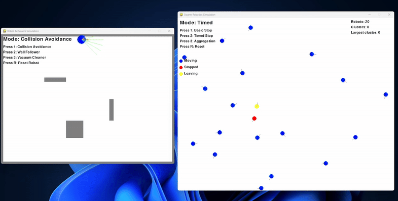

# SwarmSim-Py 🤖🐝
### A Lightweight Python Framework for Swarm Robotics Simulation

[](https://www.python.org/downloads/)
[](https://opensource.org/licenses/MIT)
[](https://www.pygame.org/)

A high-performance, educational swarm robotics simulator built with Python and Pygame. Designed for researchers, students, and enthusiasts to experiment with collective behaviors and emergent intelligence.



## 🌟 Features

- **Zero Dependencies**: Only requires Python and Pygame - no complex setup
- **Real-time Visualization**: Watch behaviors emerge with sensor rays, trails, and state indicators
- **Multiple Behaviors**: From basic collision avoidance to complex swarm aggregation
- **High Performance**: Optimized for 60+ FPS with 20+ robots
- **Educational**: Perfect for learning swarm robotics concepts
- **Extensible**: Easy to add new behaviors and experiments

## 🚀 Quick Start

```bash
# Clone the repository
git clone https://github.com/techieakr/swarmsim-py.git
cd swarmsim-py

# Install dependencies
pip install -r requirements.txt

# Run single robot simulation
python src/single_robot_behaviors.py

# Run swarm simulation
python src/swarm_behaviors.py
```

## 📚 Documentation

### Single Robot Behaviors

| Behavior | Description | Key Algorithm |
|----------|-------------|---------------|
| **Collision Avoidance** | Navigate while avoiding obstacles | Reactive control with 7-sensor array |
| **Wall Following** | Follow walls at constant distance | Finite state machine |
| **Vacuum Cleaner** | Achieve maximum area coverage | Hybrid spiral + randomization |

### Swarm Behaviors

| Behavior | Description | Emergent Property |
|----------|-------------|-------------------|
| **Basic Aggregation** | Stop when near other robots | Static clusters |
| **Timed Aggregation** | Leave small clusters after timeout | Dynamic clustering |
| **Advanced Aggregation** | Adaptive clustering with rejoin | Single large cluster |

## 🎮 Controls

### Single Robot Mode
- `1` - Collision Avoidance
- `2` - Wall Following  
- `3` - Vacuum Cleaner
- `R` - Reset position

### Swarm Mode
- `1` - Basic aggregation
- `2` - Timed aggregation
- `3` - Advanced aggregation
- `R` - Reset swarm

## 🔧 Configuration

Edit `config.py` to customize:

```python
# Simulation parameters
SCREEN_WIDTH = 1000
SCREEN_HEIGHT = 800
FPS = 60

# Robot parameters
ROBOT_SIZE = 10
ROBOT_SPEED = 2.0
SENSOR_RANGE = 100

# Swarm parameters
NUM_ROBOTS = 20
AGGREGATION_DISTANCE = 30
WAIT_TIME = 120
```

## 📊 Examples

### Creating Custom Behaviors

```python
class CustomRobot(Robot):
    def custom_behavior(self):
        # Sense environment
        self.sense_neighbors(robots)
        
        # Make decision
        if self.neighbors:
            self.angle += 0.1
        
        # Act
        self.update_position()
```

### Running Experiments

```python
from swarmsim import SwarmSimulation, metrics

# Create simulation
sim = SwarmSimulation(num_robots=50)

# Run experiment
results = sim.run_experiment(
    behavior="aggregation",
    duration=1000,
    trials=10
)

# Analyze results
metrics.plot_cluster_dynamics(results)
```

## 📈 Performance

Tested on various systems:

| System | Robots | FPS |
|--------|--------|-----|
| RTX 4080 | 20 | 60+ |
| RTX 3060 | 20 | 60+ |

## 🤝 Contributing

Contributions are welcome! Please feel free to submit a Pull Request. For major changes, please open an issue first to discuss what you would like to change.

1. Fork the repository
2. Create your feature branch (`git checkout -b feature/AmazingFeature`)
3. Commit your changes (`git commit -m 'Add some AmazingFeature'`)
4. Push to the branch (`git push origin feature/AmazingFeature`)
5. Open a Pull Request

## 📖 Citing

If you use SwarmSim-Py in your research, please cite:

```bibtex
@software{swarmsim-py,
  author = Akshay Kumar,
  title = {SwarmSim-Py: A Lightweight Python Framework for Swarm Robotics},
  year = {2025},
  url = {https://github.com/techieakr/swarmsim-py}
}
```

## 🎓 Educational Resources

- [Tutorial 1: Understanding Swarm Behaviors](docs/tutorials/01_basics.md)
- [Tutorial 2: Implementing Custom Behaviors](docs/tutorials/02_custom_behaviors.md)
- [Tutorial 3: Analyzing Emergent Properties](docs/tutorials/03_analysis.md)

## 🗺️ Roadmap

- [ ] Add A* pathfinding for single robots
- [ ] Implement pheromone communication
- [ ] Add 3D visualization option
- [ ] Create web-based interface
- [ ] Add reinforcement learning examples
- [ ] Implement ROS2 bridge

## 📝 License

This project is licensed under the MIT License - see the [LICENSE](LICENSE) file for details.

## 🙏 Acknowledgments

- Developed as part of the Collective Robotics course at the University of Lübeck
- Inspired by ARGoS, NetLogo, and other swarm simulators
- Thanks to the Pygame community for the excellent framework

## 📬 Contact

- **Author**: Akshay Kumar
- **Email**: baliyan.akr@gmail.com
- **LinkedIn**: [LinkedIn](https://www.linkedin.com/in/akshay-kumar-august03/)
- **GitHub**: [GitHub](https://github.com/techieakr)

---

<p align="center">
  Made with ❤️ by robotics enthusiasts for robotics enthusiasts
</p>
